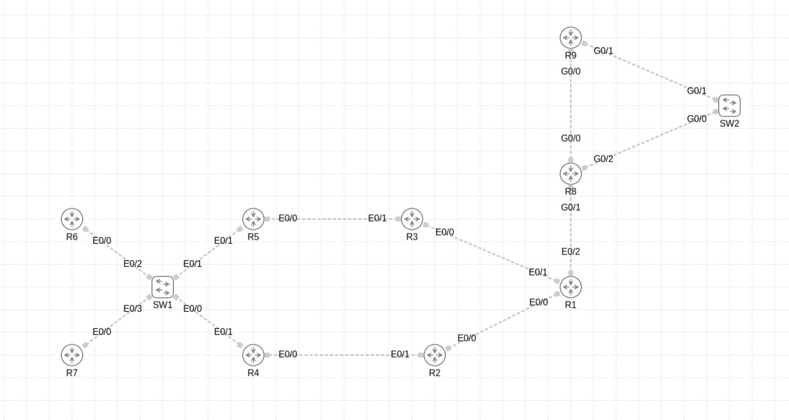

# Automating CML Topology Creation
The Python code that I provided is essentially a topology generator for Cisco Modeling Labs (CML), which is a network simulation platform used for designing, testing, and validating network configurations. Let me break down why this Python code is useful and why you might need it for CML:

## Installation

Provide installation instructions and usage details here.

## Ingredients

  * [CML](https://software.cisco.com/download/home/286193282/type/286326381/release/CML-Free)
  * [vmWare Workstation](https://support.broadcom.com/group/ecx/productdownloads?subfamily=VMware+Workstation+Pro)
  * 
## Prerequisites

A\. Add the Cisco IOSv,IOSvL2, IOL and IOLL2 to the CML .

<pre>
$ <b>CML</b>
cisco-iosv        vios-adventerprisek9-m.spa.159-3.m6.qcow2
cisco-iosvl2      vios_l2-adventerprisek9-m.ssa.high_iron_20200929.qcow2
cisco-iol         x86_64_crb_linux-adventerprisek9-ms.iol
cisco-iol2        x86_64_crb_linux_l2-adventerprisek9-ms.iol
</pre>

# Automating Topology Creation
CML allows you to create network topologies manually using its graphical user interface (GUI). However, for large or complex topologies, manually adding devices, connections, and configurations can be time-consuming and error-prone. This Python script automates the process by:

1 - Reading a simple text file (input.txt) that defines the connections between devices.
2 - Generating a YAML file (Router_Configuration.yaml) that CML can import to create the topology automatically.

This saves a lot of time, especially when dealing with large-scale networks.

# Example Use Case
Imagine you are designing a network with 10 routers and 5 switches, all interconnected in a specific way. Instead of manually adding each device and connection in CML:

You define the connections in input.txt:
<pre>
$ <b> For routers: </b>
Routers starting with "r" should have node_definition: iol-xe.
Routers starting with "R" should have node_definition: iosv.
</pre>

<pre>
$ <b>For switches:</b>
Switches starting with "s" should have node_definition: ioll2-xe.
Switches starting with "S" should have node_definition: iosvl2.
</pre>
## Steps

1\. Clone this GitHub repo and _cd_ into the directory.

<pre>
$ <b>git clone https://github.com/acaldir/generate_cml_yaml.git</b>
$ <b>cd generate_cml_yaml</b>
</pre>

2\. Create a router connections on input.txt as you can see as a example.
<pre>
$ <b>
Device     Interface  Remote Device   Remote Interface
r1         e0/0       r2              e0/0
r1         e0/1       r3              e0/0
r2         e0/1       r4              e0/0
r3         e0/1       r5              e0/0
s1         e0/0       r4              e0/1
s1         e0/1       r5              e0/1
s1         e0/2       r6              e0/0
s1         e0/3       r7              e0/0
r1         e0/2       R8              g0/1
R9         g0/0       R8              g0/0
S2         g0/0       R8              g0/2
S2         g0/1       R9              g0/1
</b>
</pre>

Here is an image from the example lab network diagram JPG file:

3\. Run the Python script, which generates a YAML file (Router_Configuration.yaml).
 
<pre>
$ <b>python3 cml_router_generator.py</b>
</pre>

4\. You import the YAML file into CML, and the topology is created automatically.

